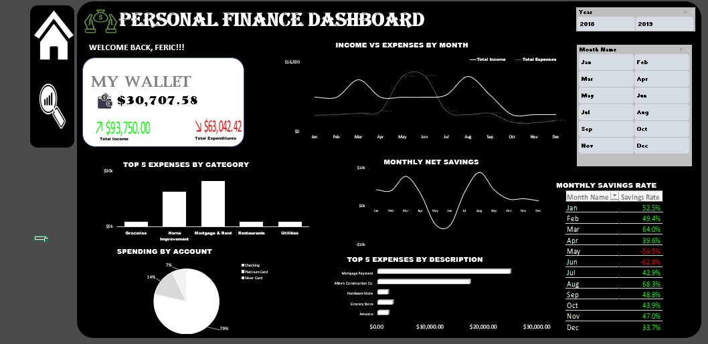

# 💰 Personal Finance Dashboard (Excel)

An interactive Excel dashboard analyzing personal income, expenses, and savings behavior across 2018–2019, built with Power Query, Power Pivot (DAX), and PivotCharts.

## 📑 Table of Contents
- [Overview](#overview)
- [Tools Used](#tools-used)
- [Dataset](#dataset)
- [Data Cleaning & Transformation](#data-cleaning--transformation)
- [Dashboard](#dashboard)
- [Key Insights](#key-insights)
- [Recommendations](#recommendations)
- [Future Work](#future-work)
- [Repo Structure](#repo-structure)

## Overview
This project analyzes a personal transaction history (checking + two credit card accounts) against a monthly household budget to answer:
- How much was earned vs. spent, and how much was actually saved?
- Which categories consume the most spending, and how does actual spend compare to budget?
- How does income vs. expenses trend month over month?
- What is the running/cumulative balance at any point in time?

## Tools Used


## Dataset
Two source files:
| [`personal_transactions.csv`](data/personal_transactions.csv) | 806 transactions (Jan 2018 – Sep 2019) across 3 accounts (Checking, Platinum Card, Silver Card), with Date, Description, Amount, Transaction Type, Category |
| [`Budget.csv`](data/Budget.csv) | Monthly budget target per spending category |
## Data Cleaning & Transformation
Performed in Power Query:
- Corrected data types (Date → Date, Amount → Decimal Number)
- Added a **Flow Type** calculated column to classify every row as `Income`, `Expense`, or `Transfer` — critical fix, since raw "Credit Card Payment" transactions double-counted spending (money moving from Checking to pay off a card was appearing as an expense on top of the original purchase)
- Added **Year** and **Month Name** columns from Date for time-based analysis and slicers
- Sorted Month Name by a numeric Month column so it displays Jan → Dec instead of alphabetically
- Trimmed/cleaned text fields (Description, Category)
- Loaded both tables to the **Data Model** and built a relationship: `Transactions[Category] → Budget[Category]`

### DAX Measures (Power Pivot)
| Measure | Formula (logic) | Purpose |
|---|---|---|
| Total Income | SUM of Amount where Flow Type = "Income" | Total earnings |
| Total Expenses | SUM of Amount where Flow Type = "Expense" | Total real spending (transfers excluded) |
| Net Savings | Total Income − Total Expenses | Money kept |
| Savings Rate | Net Savings ÷ Total Income | % of income saved |
| Budget Variance | Budget − Total Expenses (by category) | Over/under budget per category |
| Running Balance | Net Savings recalculated across all dates ≤ latest filtered date | Cumulative balance at any point in time, responsive to Year/Month slicers |

## Dashboard

📊 [Download the Excel Dashboard](dashboard/Personal-finance-Dashboard.xlsx)



**Layout includes:**
- **KPI tiles:** My Wallet (net balance), Total Income, Total Expenditure — color-coded green/red with directional arrows
- **Income vs Expenses by Month** — line chart
- **Top 5 Expenses by Category** — column chart
- **Top 5 Expenses by Description** — bar chart
- **Spending by Account** — pie chart (Checking / Platinum Card / Silver Card)
- **Monthly Net Savings** — line chart
- **Monthly Savings Rate** — table, conditionally colored green (positive) / red (negative)
- **Year slicer** (2018 / 2019) connected to all visuals for one-click filtering

## Key Insights
- **Total income: $93,750** | **Total expenses: $63,042.42** | **Net balance: $30,707.58** — an overall savings rate of roughly 33% across the full period.
- **Housing costs dominate spend.** Mortgage & Rent and Home Improvement are by far the two largest expense categories, dwarfing Groceries, Restaurants, and Utilities combined.
- **Two line items drive most of total spend:** "Mortgage Payment" (~$29K) and "Mike's Construction Co." (~$21–22K, home improvement/contractor work) together account for the majority of all expenses — day-to-day spending (groceries, Amazon, hardware store) is comparatively minor.
- **May and June are the only negative-savings months**, at **-59.5%** and **-62.8%** respectively — visible on the Income vs Expenses chart as the point where the expenses line spikes above income. This lines up directly with the Home Improvement/construction spend.
- **Every other month stays healthy**, ranging from ~34% to 68% savings rate — August is the strongest month (68.3%), March close behind (64.0%).
- **Spending is concentrated in one account:** 79% of all spend flows through Checking, with Platinum Card at 14% and Silver Card at just 7% — the credit cards are comparatively underused.

## Recommendations
1. **Treat the May–June dip as a known event, not a red flag** — since it lines up with a one-time home improvement/construction cost. If this is likely to recur, build a dedicated home-improvement sinking fund ahead of time so the savings rate doesn't go negative again.
2. **Prioritize budget accuracy on Mortgage & Rent and Home Improvement** over smaller categories — since these two account for most of total spend, small budgeting errors there matter far more than fine-tuning Restaurants or Utilities.
3. **Credit card usage is low relative to Checking (21% combined vs. 79%)** — if the cards offer cashback/rewards, shifting more routine spend there could capture value currently left on the table.
4. **Track small recurring items (Amazon, Grocery Store) as an ongoing category, not one-off entries** — they're easier to trim month-to-month than the two large housing-related expenses.

## Future Work
- Add Month-level slicer alongside Year for finer-grained filtering
- Extend Running Balance to a forecast/projection view
- Migrate to Power BI for web-based sharing and mobile view

## Repo Structure
```
personal-finance-dashboard/
│
├── data/
│   ├── personal_transactions.csv
│   └── Budget.csv
├── dashboard/
│   └── Personal-finance-Dashboard.xlsx   (contains both Analysis and Visuals sheets)
├── screenshots/
│   └── dashboard-overview.png
└── README.md
```
